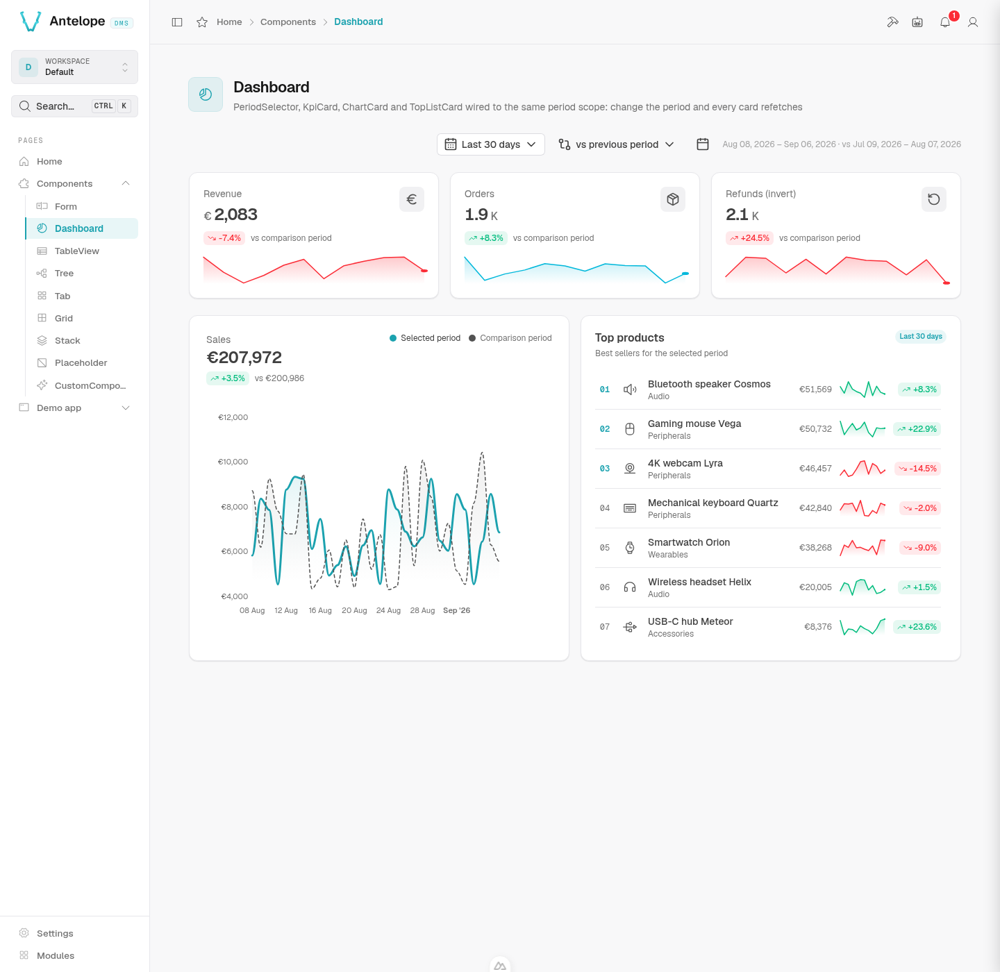

# template-cms-demo

A runnable [AntelopeJS](https://antelopejs.com) CMS demo wiring together the
feature modules listed below, plus a local module that exposes a **Home** page (a
pretty in-CMS readme), a **Components** catalog showcasing every built-in CMS
component and a small **Demo app** (users / projects / tasks with relations).
All page texts are translated in English and French through the local
nuxt-layer's i18n files.



## What's inside

The CMS feature modules are all installed from npm at their latest compatible
published versions (see [`antelope.config.ts`](./antelope.config.ts)):

| Module            | Package                              |
| ----------------- | ------------------------------------ |
| CMS core          | `@antelopejs-private/cms`            |
| API               | `@antelopejs-private/cms-api`        |
| Database          | `@antelopejs-private/cms-database`   |
| Automation        | `@antelopejs-private/cms-automation` |
| SaaS              | `@antelopejs-private/cms-saas`       |
| AI                | `@antelopejs-private/cms-ai`         |
| Lang / i18n       | `@antelopejs-private/cms-lang`       |
| CI/CD             | `@antelopejs-private/cms-cicd`       |
| Builder           | `@antelopejs-private/cms-builder`    |
| Media library     | `@antelopejs-private/cms-media`      |

Supporting infrastructure modules (MongoDB, API server, auth, file storage,
mailer, …) are configured in the same file.

The Media module adds a Finder-style asset library with folders, ACLs, direct
uploads and image derivatives. The Form demo includes an `AssetType` gallery
bound to an automatically provisioned **Event media** folder; its permissions
are derived from the Form page.

The local module lives in [`src/`](./src):

- `src/index.ts` — module lifecycle entry point; also registers the local
  nuxt-layer via `AddNuxtLayer`.
- `src/home.ts` — the `home` page: a custom `DemoReadme` Vue component
  (shipped by the nuxt-layer) presenting what this template contains.
- `src/demo-app/` — a **Demo app** sidebar category with three related
  TableViews backed by Mongo collections seeded through fixtures:
  **Users** (roles, avatars), **Projects** (status, budget, progress) and
  **Tasks** (status, priority, relations to a project and an assignee).
  Tasks open as a **kanban board** grouped by status (drag cards between
  columns; the toolbar switches back to the table).
- `src/components/` — a **Components** sidebar category with one page per
  built-in CMS component, each showing its most complete example:

  | Page           | Component(s)                                          |
  | -------------- | ----------------------------------------------------- |
  | Form           | `Form` with field groups, every `DefaultDataTypes` input and a media-library `AssetType` gallery |
  | Dashboard      | `PeriodSelector` + `KpiCard` ×3 + `ChartCard` + `TopListCard`, all sharing one period scope |
  | TableView      | `TableView` over a demo Mongo collection: filter tabs, CRUD, archive, export |
  | Tree           | `Tree` (static nodes, multi-select, propagation)      |
  | Tab            | `Tab` (icons, badges, shortcuts, persisted state)     |
  | Grid           | `Grid` / `GridRow` (colSpan, nested grid)             |
  | Stack          | `HStack` / `VStack` / `Spacer` app shell              |
  | Placeholder    | `Placeholder`                                         |
  | CustomComponent| Project Vue component shipped by the local nuxt-layer |

  The Dashboard cards fetch deterministic demo data from
  `src/components/demo-api.ts` (`/api/components-demo/sales`, `kpi/:metric`,
  `top-products`), so changing the period or comparison refetches every card;
  the TableView page seeds a `components_demo_tasks` collection through a
  `@Fixture`, and the Form page seeds a self-referencing
  `components_demo_topics` collection backing its cascader and relation
  inputs.
- `nuxt-layer/` — a local Nuxt layer shipping the `DemoReadme` and
  `DemoCallout` Vue components plus the English/French translations
  (`i18n/locales/demo-*.json`). Registered in `src/index.ts` via
  `AddNuxtLayer`.

## Translations

Every backend-declared text (page names, descriptions, form labels, card
titles, column headers, select items…) uses the `$key` convention: a string
starting with `$` is resolved against the i18n catalogs by the frontend
(`processI18n`). Add or edit keys in `nuxt-layer/i18n/locales/demo-en-GB.json`
and `demo-fr-FR.json`. Known limitation: TableView **tab labels** are not
translated by the frontend, so they stay in plain English.

## Prerequisites

- Node.js 22 and pnpm 10.2.0 (the version in `packageManager`)
- A running MongoDB instance (`mongodb://localhost:27017` by default)
- Access to the private AntelopeJS npm registry, with a valid token configured
  in your user-level `~/.npmrc`

## Getting started

Clone this template into a new application directory. The current packages use
the private registry; keep their published `@antelopejs-private/*` names.
Configure your user-level `~/.npmrc` without committing a token:

```ini
@antelopejs-private:registry=https://npm.antelopejs.cloud/
//npm.antelopejs.cloud/:_authToken=${NPM_ANTELOPE_TOKEN}
```

Set `NPM_ANTELOPE_TOKEN` in your shell or secret manager. A `401` during install
means the registry credential is missing or invalid.

```bash
git clone https://github.com/AntelopeJS/template-cms-demo.git my-app
cd my-app
cp .env.example .env
pnpm install --frozen-lockfile
pnpm build
pnpm exec ajs project modules install
pnpm dev
```

Wait for the backend, then open another terminal in the same directory:

```bash
curl --fail http://localhost:5010/api/onboarding/informations
pnpm frontend:dev
```

Open `http://localhost:3001` and complete first-run setup to create your
administrator account. There is no preconfigured demo login. After setup,
the configured homepage is `/home`; explore **Components** and **Demo app**
in the sidebar. Fixtures populate a disposable `template_cms_demo` database.

`pnpm dev` runs the local AntelopeJS CLI with backend watching. The frontend
is a separate process, and its first start installs the shared Nuxt workspace.
The `frontend:dev` script loads `.env` before launching the loader, including
the server-only session password. If backend discovery fails, use
`pnpm frontend:dev -b http://localhost:5010`.

You do not need working Stripe or AI credentials to explore the component
catalog. Payment and provider-backed actions require real test credentials;
the placeholders are not functional integrations. Treat the example JWT and
session secrets as local-only and replace them before a shared deployment.

## Configuration notes

- **MongoDB**: adjust `mongodb.config.url` / `database` in `antelope.config.ts`.
- **Media storage**: `file-storage-local` stores development assets under
  `.antelope/file-storage` and removes abandoned staged uploads after 24 hours.
  It is not suitable for a clustered production deployment; use
  `@antelopejs/file-storage-s3` with S3 or R2 there.
- **SaaS / Stripe**: Stripe credentials are read from `.env` (loaded via
  `dotenv` and mapped through `envOverrides` in `antelope.config.ts`). Copy
  `.env.example` to `.env` and set `STRIPE_SECRET_KEY`,
  `STRIPE_PUBLISHABLE_KEY` and `STRIPE_WEBHOOK_SECRET`. The `.env` file is
  git-ignored; the placeholder values in the config act as fallbacks.
- **Modules frontend**: every CMS feature layer is registered by its module's
  `AddNuxtLayer` call. Remove the module block in `antelope.config.ts` to drop
  a feature.
- **CI/CD**: Git write operations are disabled by default. Enable
  `allowGitOperations` only when you intentionally want the dashboard to
  perform Git operations against your repository.
- **Frontend origin**: the default is `http://localhost:3001`. If you change
  the loader port with `PORT`, update `CMS_CLIENT_BASE_URL` in `.env` to match.
